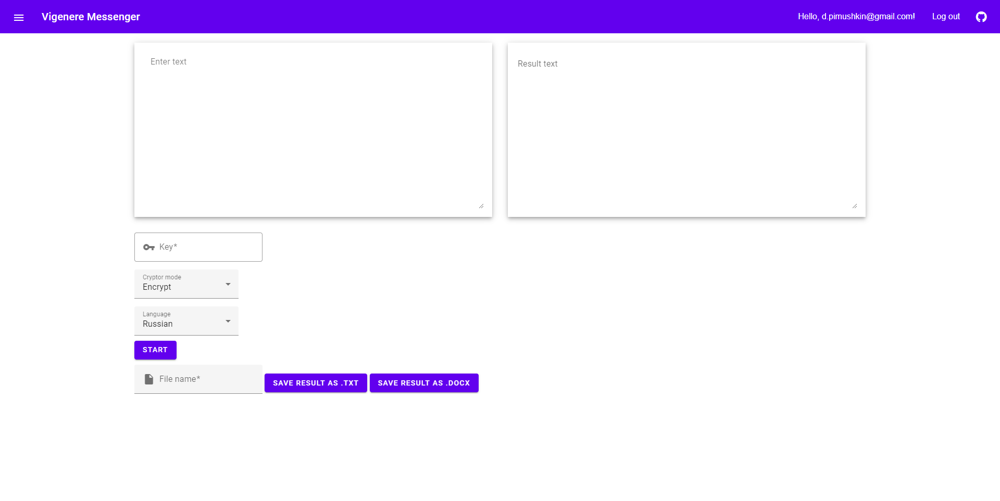

# Vigenere Cipher
## Table of contents
* [General info](#general-info)
* [Interface design](#interface-design)
* [Technologies](#technologies)

## General info
This web application is the coursework([text of task](./task/Курсовой%20проект%20v5.pdf)) of the additional course "NowYouSeeSharp" held at ITMO University by [First Line Software](https://firstlinesoftware.ru/). This app is designed to encrypt and decrypt text using the Vigenere cipher. It can also work with docx and txt files.

UPD: The web application has added authorization for exchanging messages between users. These messages are encrypted on the server and stored in the database in encrypted form.

## Interface design

The user interface was designed using Material Design.

## Technologies
Project is created with:
* DocumentFormat.OpenXml: 2.10.1
* MatBlazor: 2.4.3
* Microsoft.AspNetCore.Diagnostics.EntityFrameworkCore: 3.1.3
* Microsoft.AspNetCore.Identity.EntityFrameworkCore: 3.1.3
* Microsoft.AspNetCore.Identity.UI: 3.1.3
* Microsoft.EntityFrameworkCore.SqlServer: 3.1.3
* Microsoft.EntityFrameworkCore.Tools: 3.1.3
* System.Text.Encoding.CodePages: 4.7.0